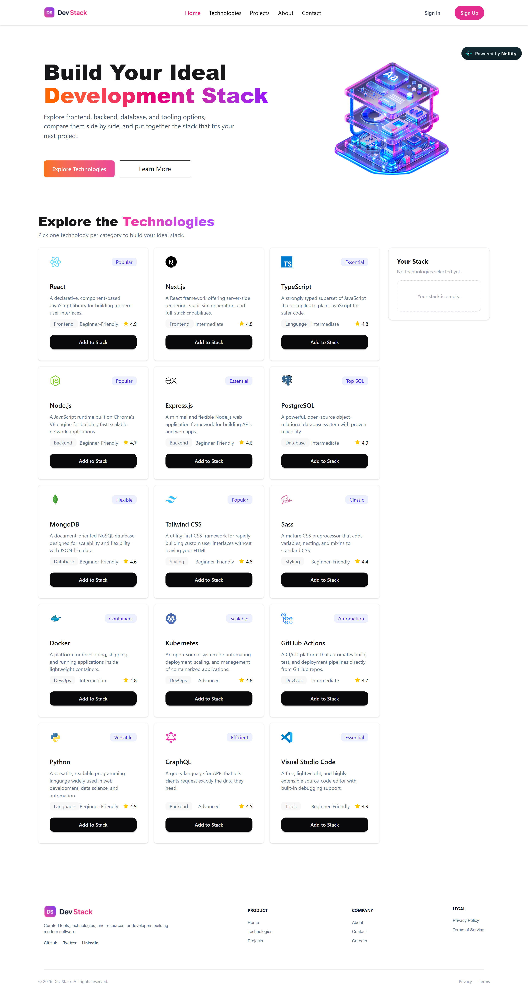

# 🚀 DevStack-React

**DevStack-React** is a React-based technology data management application where users can explore different technologies and add their preferred technologies to their own stack.

The project was built to practice and demonstrate some of the core React concepts such as **components, props, state, useState, useEffect, event handling, `.map()`, conditional rendering, and reusable components**.

## 📸 Project Screenshot

---

## 🔗 Live Project

- **Live Demo:** [DevStack-React](https://devstack-reactproject.netlify.app/)
- **GitHub Repository:** [Add your GitHub repository link here](#)

---

Technology information is loaded dynamically from a JSON file and displayed on the website using React components.

This helped me practice working with external data and rendering dynamic content in React.

2. Add Technologies to Your Stack

Users can select the technologies they are interested in and add them to their personal stack.

The selected technologies are managed using React state.

3. Interactive UI

The UI changes based on the user's actions. For example, when a technology is added to the stack, the selected list updates immediately without reloading the page.

I used React concepts like:

useState
useEffect
Props
Event handling
.map()
Conditional rendering
Reusable components
4. Empty Stack Handling

If the user hasn't added anything to their stack yet, the application shows an empty-state message instead of displaying an empty list.

5. Toast Notifications

React-Toastify is used to show notifications when users interact with the application.

🛠️ Technologies Used

The main technologies and tools I used to build this project are:

Technology	Purpose
React.js	Building the user interface
TypeScript	Writing type-safe React code
JavaScript (ES6+)	Application logic and functionality
Tailwind CSS	Styling and responsive design
DaisyUI	Pre-built UI components
React-Toastify	Showing toast notifications
JSON	Storing technology data
Vite	Development server and build tool
📦 Dependencies

Some of the main packages used in this project are:

react
react-dom
react-toastify
tailwindcss
daisyui

The project also uses Vite as the build tool and TypeScript for type checking and development.

The complete list of dependencies can be found in the project's package.json file.

⚙️ How to Run the Project Locally

If you want to run this project on your local machine, follow these steps.

1. Clone the repository
git clone YOUR_GITHUB_REPOSITORY_LINK
2. Go to the project folder
cd DevStack-React
3. Install dependencies
npm install
4. Start the development server
npm run dev

After that, Vite will give you a local URL, usually something like:

http://localhost:5173

Open the URL in your browser and the project should be running.

📁 Project Structure

A simplified version of the project structure looks like this:

DevStack-React/
├── public/
├── src/
│   ├── components/
│   ├── assets/
│   ├── data/
│   ├── App.tsx
│   ├── main.tsx
│   └── ...
├── package.json
├── tsconfig.json
├── vite.config.ts
└── README.md

The exact folder structure may be slightly different depending on the current version of the project.

⚛️ React Concepts I Practiced

This project was mainly built to strengthen my understanding of React fundamentals.

JSX

JSX stands for JavaScript XML. It allows us to write HTML-like syntax inside JavaScript/TypeScript.

For example:

<h1>My Technology Stack</h1>

JSX makes it easier to describe what the UI should look like.

Props vs State

I used both props and state throughout the project.

Props are used to pass data from a parent component to a child component.

State is used to store and manage data that can change inside a component.

For example:

<TechDataCard
  techData={techData}
  isAdded={isAdded}
/>

Here, techData and isAdded are passed to the child component through props.

useState

I used the useState hook to manage the selected technologies.

When a user adds a technology to their stack, the state is updated and React automatically updates the UI.

const [selectedTechs, setSelectedTechs] = useState([]);
useEffect

I used useEffect to load the technology data when the component initially renders.

This is useful when we need to perform a side effect, such as loading data.

.map()

I used .map() to display the technology data dynamically instead of writing each card manually.

For example:

techData.map((tech) => (
  <TechDataCard
    key={tech.id}
    techData={tech}
  />
))
Why is key important in .map()?

Each item in a React list needs a unique key.

React uses the key to identify individual items when the list changes. This helps React update the correct elements efficiently.

Conditional Rendering

I also used conditional rendering in the YourStack.tsx component.

If the selected technology list is empty:

selectedTechs.length === 0

the application displays:

Your stack is empty

Otherwise, it displays the technologies that the user has added.

Passing Data Between Components

A parent component can send data to a child component using props.

For example:

<TechDataCard
  techData={techData}
  onAddTech={handleAddTech}
/>

The child component can then call the function passed by the parent when the user clicks the Add to Stack button.

For example:

onAddTech(techData);

This allows the child component to communicate an action back to the parent, while the parent remains responsible for updating the main state.

🎯 What I Learned From This Project

While building DevStack-React, I got more comfortable with:

Creating reusable React components
Passing data through props
Managing state with useState
Using useEffect
Rendering lists with .map()
Using conditional rendering
Handling user events
Working with JSON data
Managing selected items in React state
Building a responsive UI with Tailwind CSS
Using third-party npm packages
Working with React and TypeScript together

This project helped me understand how different React concepts work together in a real application instead of using them separately in small examples.

🔗 Relevant Links
🌐 Live Demo: YOUR_LIVE_LINK
💻 GitHub: YOUR_GITHUB_REPOSITORY_LINK
📦 React: https://react.dev/
⚡ Vite: https://vite.dev/
🎨 Tailwind CSS: https://tailwindcss.com/
🌼 DaisyUI: https://daisyui.com/
🔔 React-Toastify: https://fkhadra.github.io/react-toastify/
👩‍💻 About the Project

DevStack-React was created as a practice project to improve my React development skills and understand how components, state, props, events, and dynamic data work together.

I focused more on understanding the React fundamentals and building the features myself rather than making the project unnecessarily complicated.

🚀 Future Improvements

Some features I may add in the future:

Search technologies
Filter technologies by category
Remove technologies from the stack
Save the selected stack using Local Storage
Add more technology categories
Improve accessibility and animations

Built with ❤️ using React, TypeScript & Tailwind CSS.
